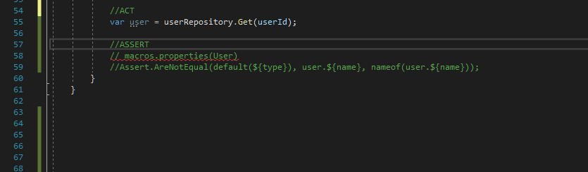

# CsharpMacros
A simple template base system of macros for Visual Studio that can be executed in design time



## Releases
- [nuget](https://www.nuget.org/packages/CsharpMacros/)
- [VS extension](https://marketplace.visualstudio.com/items?itemName=54748ff9-45fc-43c2-8ec5-cf7912bc3b84.csharpmacros2)

### Support for VisualStudio.
Install as a NuGet package or VSIX. Verify your Roslyn integration option in case you are using R#.

### Support JetBrains Rider
Install as a nuget package

### Support for VSCode
Install as a NuGet package and check `Enable support for Roslyn analyzers, code fixes and rulesets` in Settings.

## LiveTemplates for CsharpMacros
To facilitate usage of `CsharpMacros` I created a couple of Resharper LiveTemplates. You can read more about that on the [snippets](/snippets) sub-page.

## Macro anatomy


Every macro consists of the following parts

1. `Macro Header` in the following format `macros.macro_function(macro_params)`. 
2. `Macro Template` - a template of code that will be repeated for every element returned by the macro function. The template can contain placeholders in the following format `${attribute_name}` that will be replaced with a given attribute value of the element returned by the macro function.
3. `macro_function` represents one of the predefined functions that generate input data for the template. 
4. `macro_params` is the input for macro function.
5. The placeholder that will be replaced with the value of the given attribute. Placeholders can also contain filters that transform the attribute value. Syntax for placeholder with filter `${attribute_Name | filter_name}`. The filters can be combined together by chaining them with `|` operator. Currently available filters: `lowercase`, `uppercase`, `pascalcase`, `camelcase`.


## Macro functions

### properties

**Description:** Returns a list of properties of given type accepted as the parameter. 

**Parameters:** Type name. For types from other projects/assemblies include also the namespace.

**Attributes:**
- `name` - name of the property
- `type` - type of the property
- `typeLong` - type of the property.  For primitives from `System` namespace, holds the full name (example: `int` -> `Int32`)

**Examples**:

```cs
// macros.properties(SampleType)
// Console.WriteLine("Property '${name}' of type '${type}'")
```

### methods
**Description:** Returns a list of methods of a given type accepted as the parameter.

**Parameters:** Type name. For types from other projects/assemblies include also the namespace.

**Attributes:**
- `name` - name of the method
- `returnType` - name of the return type
- `returnTypeLong` - name of the return type. For primitives from `System` namespace, holds the full name. Example: `int` -> `Int32`)
- `signature` - a complete method signature. Example: `int Calculate(int a, int b)`
- `returnOperator` - empty string for `void` methods, otherwise `return` keyword
- `parameters` - comma separated list of parameters wrapped in parenthesis. Example: `(a, b, c)`
- `genericParameters` - comma separated list of generic type parameters wrapped in angle brackets. Example: `<T1, T2, T3>`
- `paramNameX` - name of the parameter.  X marks the number of the parameter.
- `paramTypeX` - name of the parameter type.  X marks the number of the parameter.
- `paramTypeLongX` - name of the parameter type.  X marks the number of the parameter. For primitives from `System` namespace, holds the full name (example: `int` -> `Int32`)


**Examples**:

```cs
// macros.methods(SampleType)
// Console.WriteLine("Method name: ${name}")
// Console.WriteLine("\t Return type: ${returnType}")
// Console.WriteLine("\t First parameter name: ${paramName1}")
// Console.WriteLine("\t First parameter type: ${paramType1}")
```

### implement

**Description:**  Returns a list of types that implement a given interface accepted as the parameter. 
**Parameters:**  Interface name. For interfaces from other projects/assemblies include also the namespace.

**Attributes:**
- `name` - the name of the class that implements the given interface
- `interface` - for a non-generic interface, this is the same as the parameter of the macro function. For generic interface contains the name of the interface with generic parameter values.

**Examples**:
```cs
// macros.implement(ISampleInterface<>)
// Console.WriteLine("Interface ${interface} is implemented by ${name}")
```

### derived
**Description:**  Returns a list of types that inherit from a given class accepted as the parameter.

**Parameters:** Type name. For types from other projects/assemblies include also the namespace.

**Attributes:**
- `name` - the name of the type that inherits from a given class
- `based` - for generic non-generic base class this is the same as the parameter of the macro function. For generic base class contains the name of the class with generic parameter values.

**Examples**:
```cs
// macros.derived(BaseClass<>)
// Console.WriteLine("Class ${name} inherits from ${based}")
```

### values

**Description:**  Returns values from the predefined list provided as a macro parameter. 

**Parameters:** List of comma-separated values or list of comma-separated tuples

**Attributes:**
- `value` - for simple list
- `valueX` - for list of tuples. X marks the number of the value inside the tuple

**Examples**:

Simple list:
```cs
// macros.values(banana, strawberry, apple)
// Console.WriteLine("Fruit ${value}")
```

List of tuples:
```cs
// macros.values((banana, yellow), (strawberry, red), (apple, green))
// Console.WriteLine("${value1} fruit has ${value2} color.")
```