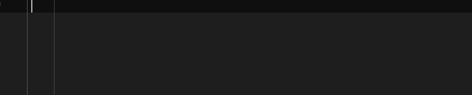
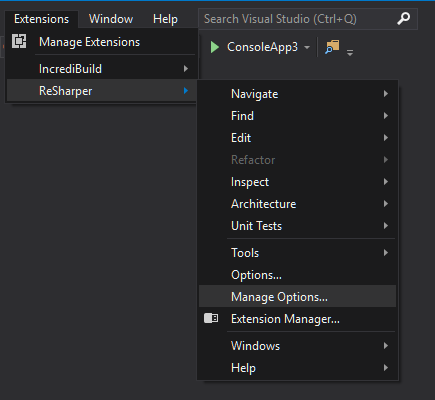
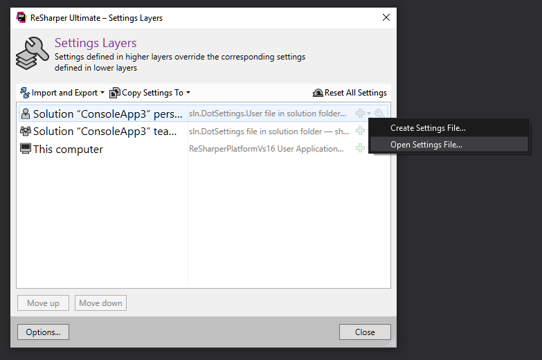
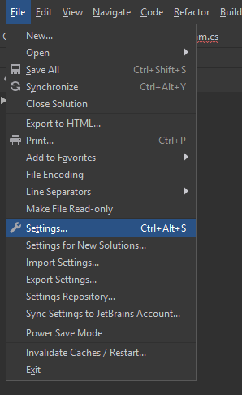
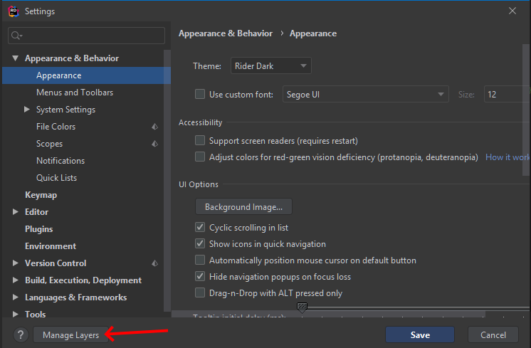
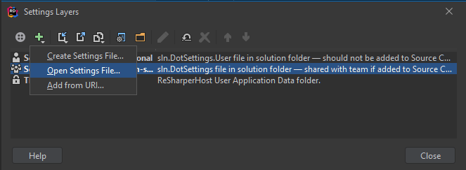

# Resharper LiveTemplates for CsharpMacros

## How to use it

Just type one of the snippets from the `Defined snippets` section (ex `macros`)  and press the `tab` key. `ReSharper` will automatically expand the shortcut into macro definition.

## Defined snippets

`macros` - general-purpose snippet with a suggestion list

`mp` - macros.properties

`mm` - macros.methods

`mi` -macros.implement

`md` - macros.derived

`mv` - macros.values

## How to Import

First download the [CsharpMacrosSnippets.DotSettings](/snippets/CsharpMacrosSnippets.DotSettings) file then perform the following steps depends on the IDE you are using.

### Resharper

1. Go to Resharper `Settings Layers` window (Extensions -> ReSharper -> Manage Options...)

2. Select the `Layer` where you want to import `Templates for CsharpMacros`. Click the green plus sign and select `Open Settings File...` 

3. Select `CsharpMacrosSnippets.DotSettings` file.

### Rider

1. Go to `Settings` window (File -> Settings...)

2. Click `Manage Layers...` button

3. Select the `Layer` where you want to import `Templates for CsharpMacros`. Click the green plus sign and select `Open Settings File...`

4. Select `CsharpMacrosSnippets.DotSettings` file.